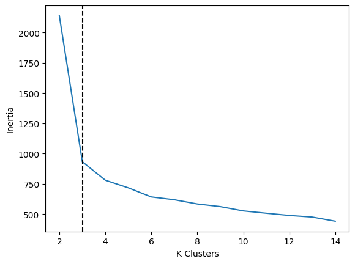
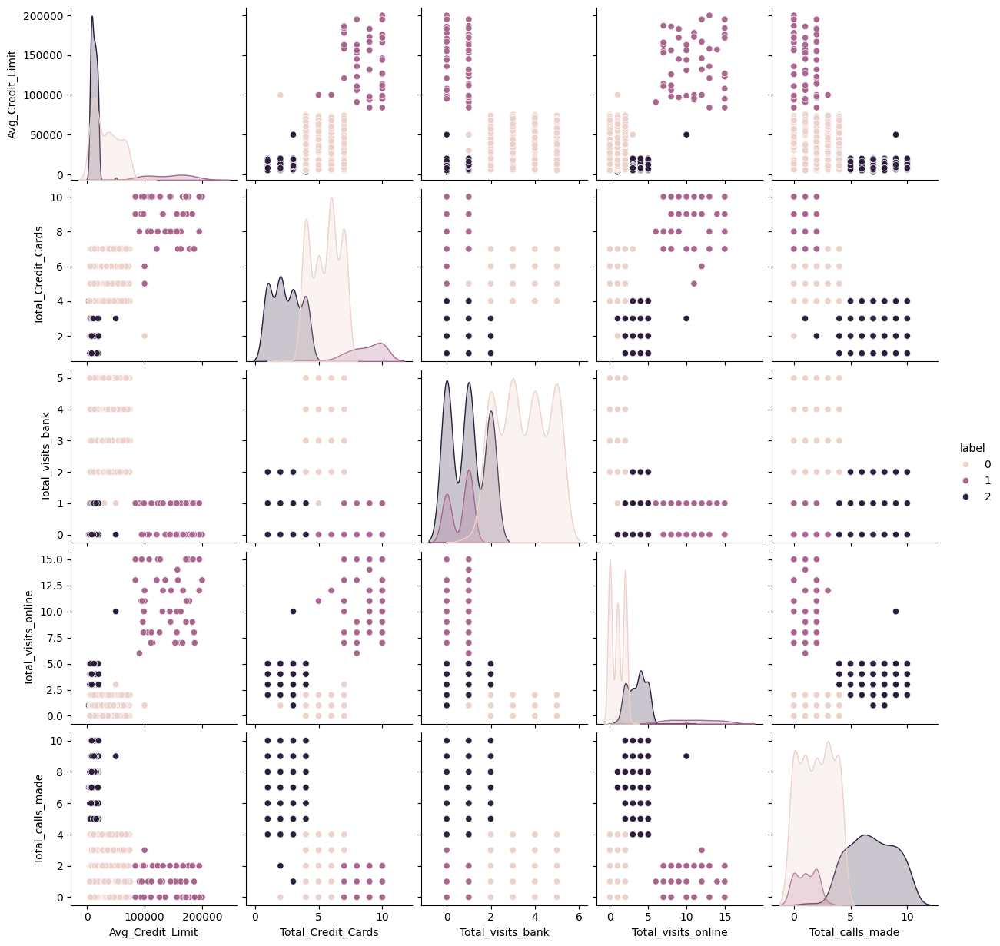

Credit Card customers segmentation using Kmeans, inertia and silhouette score.

Dataset from Kaggle: https://www.kaggle.com/datasets/rupindersinghrana/credit-card-customer-segmentation

## Metrics 

**Optimal number of clusters: 3**

## Dataset labeled with the model

